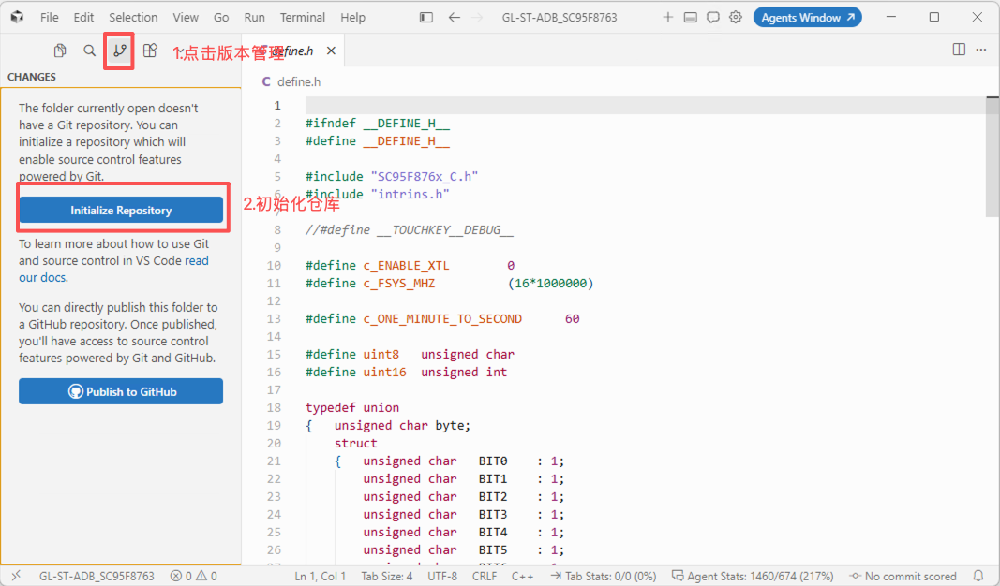
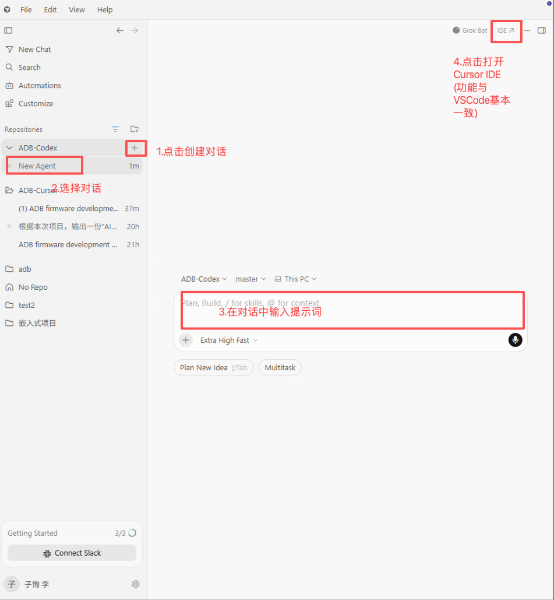
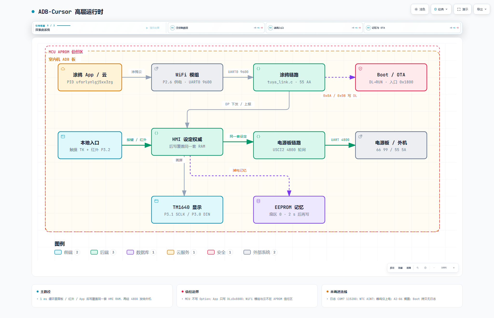

# AI嵌入式开发案例——房车空调 ADB

> 基于 `D:\嵌入式项目文件夹\ADB-Cursor` 与 Cursor 对话 `90098606-0157-47b6-9058-c92c045a2194` 整理  
> 目标芯片：赛元 SC95F8763　工具链：Keil C51　烧录器：SC-Link  
> 实施时间：2026 年 9 月 7 日—8 日  
> AI 模型：Cursor Grok 4.6（项目记录如此登记）

## 写在前面：这个案例真正验证了什么

这个项目不是“给 AI 一句话，两天后得到一套空调固件”的故事。

它验证的是另一件更有工程价值的事：当需求、可用资料、禁止参考的范围、人与 AI 的职责以及每个阶段的验收条件都被写清楚以后，AI 可以承担大量资料阅读、代码实现、编译、产物管理和故障分析工作；工程师则用实际设备的运行结果决定它是否真的完成。

项目从独立日志口开始，逐步加入时基、显示、触摸、本地人机交互、电源板通信、红外、NTC、涂鸦 WiFi、掉电记忆和 MCU OTA。每加入一层，都保留上一层的可运行基线。最终交付了 Boot 与 App 合并的 `factory.hex`、单独的 App HEX、涂鸦 OTA 包、构建脚本、验收记录和资源报告。

开工前，用户只在 Keil 中新建了工程并选择 SC95F8763 芯片型号，工程内还没有产品业务代码。此后的工程结构、驱动、业务逻辑、构建脚本和交付产物都在本轮协作中逐步完成。实验仍有清楚的复用边界：触摸部分使用了旧工程中的 Sense_Lib；OTA 参考了已经沉淀的 `sc95-ota-dual-zone` skill；NTC 表、红外时序、WiFi 供电脚、按键与触摸通道的对应关系等硬件事实由人提供或通过实际设备确认。

所以，准确的结论是：**在指定基础库、OTA 经验和工程师硬件测试配合下，AI 完成了其余固件的设计、实现、集成和多轮修复，并通过了约定范围内的阶段验收。**

---

## 第一章　先把开发变成可验证的工作

### 1.1 AI 编程质量来自闭环，不来自长提示词

嵌入式项目里，编译通过离完成还很远。串口能发不代表波特率正确，显示驱动有输出不代表段码映射正确，MCU 发出了配网命令不代表 WiFi 模组已经收到，OTA 包下载完成也不代表掉电恢复可靠。

本项目使用的基本闭环是：


这里有四个不能交换的原则。

第一，先写验收条件，再写代码。否则很容易在实现困难后降低标准，把“做不到”改写成“本来就不需要”。

第二，每次只增加一类主要风险。显示没有稳定时不接触摸，本地人机交互没闭环时不接电源板，三种控制入口没有统一时不做 OTA。这样一旦失败，候选原因仍然有限。

第三，实际设备的运行结果高于程序自述。AI 可以解释代码“应该怎样”，但按键、波形、数码管、继电器和云端行为才是设备实际发生的事情。

第四，通过点必须可恢复。每一阶段都有版本串、HEX、SHA256 和 Git 提交。下一阶段失败时，可以回到上一个已经跑过的状态，而不是在不断变大的工作区里猜哪一次改动破坏了系统。

### 1.2 人与 AI 的职责怎样划分

本项目最有效的分工不是“人提需求、AI 写代码”这么简单。

| 工作 | 人负责 | AI 负责 |
| --- | --- | --- |
| 产品行为 | 模式顺序、风速顺序、温区、掉电后行为、哪些功能可搁置 | 把确认结果写入状态机和验收页 |
| 硬件事实 | 接线、丝印、真实脚位、供电极性、手摸 NTC 后的变化 | 查手册、写寄存器配置、根据现象缩小原因 |
| 工程实现 | 决定是否接受方案 | 目录、模块接口、C51 实现、编译和产物生成 |
| 验证 | 烧录、操作面板、观察继电器和 App、制造断电 | 给出版本、步骤、预期日志和故障分支 |
| 质量门禁 | 明确回复“阶段 N 通过” | 在收到通过口令后提交基线 |

人不需要逐行指导 AI，也不应替 AI猜每个软件问题的根因；但涉及真实硬件和产品语义时，人必须给出事实。这个项目里，AI 曾把 NTC 方向判断反了，也曾在 WiFi 无接收时继续检查串口，最后是人补充“P2.6 拉低，模块才有供电”。这些不是流程失败，而是黑盒协作中必须被记录的技术输入。

### 1.3 任务为什么要拆成这些阶段

阶段顺序不是为了让文档整齐，而是按依赖关系展开：

| 阶段 | 新增能力 | 进入下一阶段前必须证明 |
| --- | --- | --- |
| -1 | 最小工程、独立日志 | 芯片运行且外部串口能读出版本 |
| 0 | 时基、资源表 | 时间尺度可信，三路 UART 职责不混淆 |
| 1A | TM1640 显示 | 每个图标和数码位能被单独验证 |
| 1B | Sense_Lib、触摸、蜂鸣 | 六个触摸通道稳定产生事件 |
| 1C | 本地人机交互 | 不依赖外机和云端即可完成全部本地设定 |
| 2 | 电源板 4800 通信 | 发送、接收、校验和继电器响应成立 |
| 3 | 红外、室内 NTC | 第二个本地入口和真实环境温度成立 |
| 4 | 涂鸦 WiFi | 面板、红外、App 写入同一状态 |
| 4C | 掉电记忆 | 关键设定可在断电后恢复 |
| 4B | MCU OTA | 正常升级及两个断电窗口均可恢复 |
| 5 | 资源与交付 | 固件不再变化，产物、限制和复现方式明确 |

这套顺序还有一个隐藏收益：它把“问题出现在哪一层”变得可判断。例如阶段 3 的红外能够改变人机交互状态，但电源板没有动作，问题应在人机交互逻辑到电源板通信之间；阶段 4 的 App 与 WiFi 灯均无响应，而本地功能正常，问题就集中在模组供电、UART 或涂鸦协议。

---

## 第二章　开发环境与工程结构

### 2.1 先准备电脑、开发板和目录

如果同事第一次使用 AI 编程工具，建议先把传统嵌入式开发环境单独验证好，再让 Agent 参与。Agent 能编辑工程、调用编译器和分析日志，但芯片支持包、烧录器驱动、串口接线和开发板供电仍要由人准备。

本案例需要以下资源：

| 类别 | 本案例使用的内容 | 准备完成的判断方法 |
| --- | --- | --- |
| 开发电脑 | Windows，PowerShell | 能打开 PowerShell 并访问工程盘符 |
| 编译环境 | Keil C51 V9.53，安装于 `D:\C51` | 能启动 µVision，能找到 `C51.exe`、`A51.exe`、`LX51.exe` 和 `OHX51.exe` |
| 芯片支持 | SC95F8763 的器件数据库、头文件和启动文件 | 新建工程时能准确选择 SC95F8763 |
| 烧录工具 | SC-Link 驱动及对应下载工具；OTA 工厂镜像使用 SOC Programming Tool | 工具能识别 SC-Link 和目标芯片 |
| AI 工具 | Cursor，或者 Codex 桌面端/CLI | 能打开本地工程目录并使用 Agent |
| 版本管理 | Git | IDE 左侧能打开“源代码管理”，并显示“初始化仓库”按钮 |
| 观察工具 | USB 转串口及串口终端 | 能选择串口号、波特率和 8N1 |
| 硬件 | ADB 板、电源板、显示板、WiFi 模组、红外遥控器 | 接线图、电源规格和公共地已确认 |

Keil、芯片支持包、SC-Link 驱动和 SOC Programming Tool 的具体安装包由公司内部统一提供，版本不同会导致菜单名称和下载算法略有差异。安装后先建一个临时的最小程序并执行一次构建，确认工具链可以启动；再连接不带电源板供电的 ADB 板，确认烧录器能够识别芯片。此时不需要编写产品功能。

随后创建一个全新的工程目录。例如本案例使用：

```text
D:\嵌入式项目文件夹\ADB-Cursor
```

这个目录一开始只服务于本轮实验。不要把旧工程复制进来，也不要在 Cursor 中同时打开包含旧工程的上级目录，否则 Agent 可能在搜索时读到不允许参考的实现。规格书、原理图和协议文档可以放在另外的资料目录，并在总提示词中逐项写出绝对路径。

### 2.2 在 Keil 中创建最小工程

Keil 官方流程的核心是：新建 µVision 工程、选择准确器件、加入启动代码和源文件、设置工具选项，然后构建并按需要生成 HEX。菜单可参考 [Keil：Create Project File](https://www.keil.com/support/man/docs/uv4cl/uv4cl_ca_createprjfile.htm) 和 [Keil：Creating Projects](https://www.keil.com/support/man/docs/uv4cl/uv4cl_ca_createproject.htm)。

本案例开工前，用户实际只做了“新建工程并选择芯片”这两件事。没有预先搭好业务目录，也没有把旧代码复制过来。按下面步骤可以得到同样的起点：

1. 启动 Keil µVision。
2. 选择 **Project → New µVision Project**。
3. 进入新目录 `D:\嵌入式项目文件夹\ADB-Cursor`，输入工程名，例如 `ADB-Cursor`，保存工程文件。
4. 在器件选择窗口中搜索并选择 **SC95F8763**。不要因为目标型号暂时找不到而选择引脚相似的其他型号；应先安装正确的赛元器件支持包，再重新建项。
5. 如果 Keil 询问是否复制启动文件，选择加入项目。若公司提供的赛元启动文件与 Keil 自动文件不同，应以芯片支持包和已确认的芯片资料为准，并记录来源。
6. 保存工程并关闭 µVision。此时即使工程还没有 `main.c`、不能生成产品固件，也已经完成本案例真实的人工起点。

接着用 IDE 自带的 Git 工具为新目录建立版本库，不需要打开终端：

1. 在 IDE 左侧活动栏点击“源代码管理”图标。
2. 确认当前打开的文件夹是本轮新工程。
3. 点击 **Initialize Repository（初始化仓库）**。
4. 初始化完成后，源代码管理面板会开始列出当前工程中的文件变化。



*图 2-1　在 IDE 的源代码管理面板中点击“初始化仓库”*

初始化仓库只是在当前目录建立本地版本记录，不会自动把工程上传到互联网，也不需要点击图中的 **Publish to GitHub**。后续每个阶段通过后保存一次提交，才能在 Agent 改坏代码或某次硬件验证失败时回到已知可用版本。如果源代码管理面板已经显示文件变化或提交历史，说明仓库已经存在，不要删除后重新初始化。

如果团队希望在交给 Agent 前先证明 Keil 可用，可以再手工完成一个最小构建：

1. 在 Project 窗口中右键 `Source Group 1`，选择 **Add New Item to Group**，新建 `main.c`。
2. 写入只包含空循环的最小入口。头文件名以安装的 SC95F8763 支持包为准，不要照抄其他 8051 型号的寄存器定义。
3. 打开 **Project → Options for Target**，依次检查：
   - **Device**：SC95F8763；
   - **Target**：晶振或内部时钟按开发板实际配置填写；
   - **Output**：指定输出目录，并勾选 **Create HEX File**；
   - **C51/A51**：加入芯片头文件和启动文件所在目录；
   - **Debug/Utilities**：只在已经安装 SC-Link 支持后配置下载器。
4. 选择 **Project → Rebuild all target files**，确认输出为 0 Error，并能找到 HEX 文件。Keil 对 Build、Rebuild 和输出窗口的说明见 [Building Projects](https://www.keil.com/support/man/docs/uv4cl/uv4cl_ca_buildproject.htm)。

这一步只验证工具链，不要提前设置最终 OTA 的地址划分，也不要照搬旧工程的 LARGE 模型、链接定位和中断向量。那些设置应在功能和容量确实需要时由当前工程推导出来。本案例在阶段 1B 才切换到 LARGE/LX51，阶段 4B 才建立 Boot、RUN、DL 三个 Flash 区域。

### 2.3 用 Cursor 打开工程并创建第一次 Agent 对话

Cursor 中所谓“创建项目”，实际操作通常是打开一个本地文件夹。这个文件夹就是 Agent 搜索、编辑和运行命令的工作范围。Cursor 官方快速入门也采用“打开已有项目或克隆仓库，再打开 Agent 对话”的流程，见 [Cursor Quickstart](https://docs.cursor.com/en/get-started/quickstart)。

第一次操作可按下面步骤进行：

1. 安装 Cursor，登录可用账号。打开左侧“源代码管理”面板；如果 IDE 提示找不到 Git，应先安装 Git，然后重启 IDE。
2. 打开 Cursor，选择 **File → Open Folder**，选中 `D:\嵌入式项目文件夹\ADB-Cursor`。也可以在命令行使用 `cursor "D:\嵌入式项目文件夹\ADB-Cursor"`。
3. 如果出现工作区信任提示，核对路径确实是本轮新工程后再信任。

下图以 Codex 桌面端为例，标出了创建新对话、选择对话、输入总提示词和打开 IDE 的位置。使用 Cursor 时，操作目的相同：先进入正确的工程，再创建 Agent 对话并发送提示词。



*图 2-2　创建 Agent 对话、输入提示词并打开 IDE*

4. 查看左侧文件树，确认根目录就是 `ADB-Cursor`，而不是 `D:\嵌入式项目文件夹`。根目录开得过大，会把旧项目也暴露给 Agent。
5. 按 `Ctrl+I` 打开 Chat/Agent 面板。不同 Cursor 版本的模式名称可能不同，应选择能够读取和修改工作区、运行终端命令的 Agent 模式。
6. 新建一轮对话。模型可以按团队账号可用情况选择，但应把模型名称和版本记录在案例中，以便后续比较。
7. 先打开附录 A，把其中所有本机路径、串口号和工程名改成当前机器的真实值。本案例原提示词第十三节曾把目录误写成 `ADB-Codex`，复现时必须统一修正为新工程目录。
8. 将完整总提示词作为第一条消息一次性发送。不要只发送“帮我写一个房车空调程序”，也不要只复制阶段 -1 的最后几行；Agent 必须先看到资料边界、允许复用项、阶段顺序和验收门禁。
9. Agent 如果申请读取某个目录或执行命令，先看清路径和命令。允许读取明确列出的资料和当前工程；旧工程除 Sense_Lib 指定文件外不在许可范围。开始阶段 -1 时，不应允许它提前复制旧业务代码。
10. 等 Agent 完成阶段 -1 的代码、构建和验收清单。此时由人断开电源板供电、连接 SC-Link、烧录并观察串口。没有收到人的“阶段 -1 通过”，Agent 不应进入阶段 0。

第一次对话开始后，正常现象不是立刻得到完整空调固件，而是看到 Agent 先做这些工作：

- 检查当前工程和允许读取的资料；
- 建立基本目录、版本文件、构建入口和阶段记录；
- 明确阶段 -1 只验证编译、烧录、运行和独立日志；
- 生成固件并给出完整路径、版本和测试步骤；
- 等待人完成硬件操作并反馈现象。

如果 Agent 一开始就实现按键、显示、电源板通信或 WiFi，应立即用一句明确指令纠正：“当前只做阶段 -1，请撤回超出阶段范围的修改，并按阶段 -1 验收清单重新交付。”

后续每天继续开发时，打开同一个文件夹和同一轮对话即可。典型操作顺序是：

```text
打开 ADB-Cursor 文件夹和原对话
  ↓
确认上一阶段已经通过，并发送“开始阶段 N”
  ↓
Agent 修改代码、构建并给出固件和验收步骤
  ↓
人断开电源板供电，烧录，再按说明恢复接线
  ↓
人操作设备并把串口日志、显示现象和继电器动作反馈给 Agent
  ↓
Agent 根据事实修改并重新交付
  ↓
全部检查符合预期后，人回复“阶段 N 通过”
```

反馈故障时应提供可以判断的信息，例如“按温度减键后串口出现 `KEY temp_down`，显示仍为 72，电源板回包设定温度为 71”，而不是只说“功能不对”。日志较长时，保存到工程的 `records` 目录并告诉 Agent 文件路径，避免在聊天中截断关键上下文。

### 2.4 用 Codex 执行同类任务

本案例的历史开发工具是 Cursor，模型记录为 Grok 4.6。团队也可以用 Codex 做同样的实验，但应把它记录为另一轮独立实验，不能把结果混写成原 Cursor 对话的一部分。

在 Codex 桌面端中，本地项目可以关联一个或多个本地文件夹，新任务默认在主文件夹中工作。根据 [OpenAI：项目和聊天](https://learn.chatgpt.com/zh-Hans/docs/projects)，可通过项目菜单编辑项目、添加文件夹并设置主文件夹。建议按以下方式操作：

1. 打开 Codex 桌面端，新建或选择一个本地项目。
2. 把 `D:\嵌入式项目文件夹\ADB-Cursor` 加入项目，并设为主文件夹。若要做真正独立的对比实验，应改用另一个全新目录，例如 `ADB-Codex`。
3. 在这个项目中创建新任务，把修正后的完整总提示词作为第一条消息。
4. 当 Codex 调用 PowerShell、编辑文件或读取资料时，检查操作是否仍在总提示词允许的范围内。
5. 使用与 Cursor 相同的阶段通过口令和硬件验收方法。一个阶段没有通过，就继续在当前任务中反馈日志；不要另开任务丢失上下文。

使用 Codex CLI 时，可以先在 PowerShell 中进入工程目录再启动，也可以执行：

```powershell
codex -C 'D:\嵌入式项目文件夹\ADB-Cursor'
```

Codex 的 IDE 扩展通常把当前打开的文件夹或工作区视为本地项目；Windows 原生 Agent 使用 PowerShell。OpenAI 的 Windows 说明还建议安装原生 Git，以支持工作树等功能，见 [OpenAI：Windows 应用](https://learn.chatgpt.com/zh-Hans/docs/windows/windows-app) 和 [OpenAI：本地环境](https://learn.chatgpt.com/zh-Hans/docs/environments/local-environment)。

无论使用 Cursor 还是 Codex，关键都不是某个按钮名称，而是同时满足三个条件：Agent 的工作根目录正确；第一条消息包含完整工程约束；每一阶段最终由硬件现象决定是否通过。

### 2.5 本案例实际使用的环境

| 项目 | 配置 |
| --- | --- |
| MCU | SC95F8763，8051 内核 |
| 编译器 | Keil C51 V9.53，工具位于 `D:\C51\BIN` |
| 链接器 | LX51，LARGE memory model，OMF2 |
| IDE | µVision；日常构建主要由 PowerShell 脚本完成 |
| 烧录 | SC-Link；OTA 工厂镜像使用 SOC Programming Tool |
| 日志 | DispUart：P0.5 TX / P0.6 RX，USCI0，115200 8N1，开发机为 COM7 |
| 电源板通信 | P4.4 TX / P4.5 RX，USCI2，4800 |
| WiFi 通信 | P2.1 TX / P2.0 RX，UART0，9600；P2.6 低电平供电 |
| 显示 | TM1640，P3.1 SCLK / P3.0 DIN |
| 红外 | P3.2，Timer1 50 μs 采样 |
| NTC | P2.3 / AIN7 |

工程采用简单的 BSP 与应用分层：

```text
ADB-Cursor/
├─ firmware/
│  ├─ bsp/            芯片外设：UART、TM1640、ADC、IAP、EEPROM
│  ├─ app/            人机交互、电源板协议、红外、涂鸦、NVM、OTA下载
│  ├─ include/        板级配置、显示映射、Flash地图、版本
│  └─ third_party/    Sense_Lib、芯片头文件、涂鸦SDK副本
├─ boot/              Boot入口、向量跳转、APROM IAP
├─ scripts/           编译、烧录、串口采集、HEX合并、OTA打包
├─ docs/acceptance/   每阶段验收页
├─ records/           构建与串口证据
└─ releases/          阶段HEX、factory.hex、OTA bin
```

主循环保持可读的超级循环结构，各入口最终汇入同一套人机交互状态：

```c
while (1)
{
    delay_ms(1);
    keys_poll();
    ir_link_poll();
    ntc_poll();
    hmi_poll();
    tuya_link_poll();
    pwr_link_poll();
}
```

运行时主路径是：本地入口 → 人机交互 → 电源板链路 → 外机。云和 WiFi 模组在 APROM 信任区外；日志、NTC、蜂鸣只作观察或辅助，不是第四条控制总线。

- 交互图：[ADB 运行时](architecture/adb-runtime.html)
- 静图：



### 2.6 为什么先建立独立日志通道

这一节要说明的是：AI要根据设备运行情况排查问题，必须先有一条不会干扰产品通信的观察通道。

本项目有三组串行通信：一组输出调试日志，一组连接电源板，一组连接 WiFi 模组。后两组承载产品协议，数据格式、波特率和发送时机都有明确要求。如果把调试信息混入其中，电源板或 WiFi 模组会把日志字符当成协议数据；大量打印还可能改变通信时序，使调试行为本身制造新故障。

因此，阶段 -1 先单独启用 P0.5/P0.6 日志串口，确保后续每增加一个功能，都能从这条通道观察版本、状态和错误。阶段 2 才启用电源板串口，阶段 4 才启用 WiFi 串口。三组串口各做一件事，后面遇到电源板无响应、WiFi 无握手或 OTA 异常时，日志通道仍然可用。

### 2.7 为什么使用命令行构建

工程后期同时包含汇编启动、C51 App、Boot、HEX 合并和 OTA 打包。单击 IDE 的 Rebuild 不能完整表达这些步骤。`scripts\build.ps1 -Rebuild` 固化了 A51、C51、LX51、OHX51、工厂镜像合并和 OTA 包生成过程，也避免多个 µVision 窗口把旧设置写回工程。

复现时首先运行：

```powershell
Set-Location 'D:\嵌入式项目文件夹\ADB-Cursor'
.\scripts\build.ps1 -Rebuild
```

阶段 4B 以后，该命令会覆盖 `releases\factory.hex`、`Stage4B.hex` 和 `Stage4B_ota.bin`。因此修改版本并重新构建后，应重新记录三个文件的哈希，不能把旧包和新版本说明混用。

---

## 第三章　真实开发过程：十次门禁怎样把功能接起来

### 3.0 总提示词先确定整项工作的规则

本轮开发不是从“阶段 -1”开始临时商量流程。对话的第一条消息就是一份完整的总提示词，全文收录在附录 A。它先说明最终要完成哪些功能，再规定工程目录、可读取资料、禁止参考的旧工程、触摸库和 OTA 的复用例外、人与 AI 的职责、阶段顺序、验收方式以及故障连续两轮无改善时如何停止无效试错。

这份总提示词相当于整个项目的工作约定。它没有预先告诉 AI 各功能应该怎样编码，但明确了开发边界和判断完成的依据。后续用户只需要说“开始阶段 2”或“开始阶段 4B MCU OTA”，AI仍然知道当前只能做什么、不能提前做什么，以及完成后必须提交哪些证据。

总提示词对后续开发产生了五个直接作用：

1. 先给出完整目标，使 AI 能按依赖关系规划阶段，而不是边写边猜下一项工作。
2. 限制旧工程的读取范围，使“独立实现”和“允许复用”能够区分。
3. 把普通实现决策交给 AI，减少用户对目录和函数拆分的逐项审批。
4. 规定实际设备验收高于编译结果，避免 AI自行宣布完成。
5. 要求阶段通过后保存版本、固件和提交，为下一阶段提供可恢复基线。

因此，下面各阶段不是十次互不相关的提示词，而是同一份总提示词下的连续执行。每个阶段只增加当前需要验证的能力，用户通过硬件操作和运行现象决定是否进入下一阶段。

### 3.1 阶段 -1：先证明“程序在跑”

开工时，用户已经在 Keil 中新建工程并选择 SC95F8763，除此之外没有产品业务实现。第一步是由 AI 在这个最小工程上建立观测链：让代码能够编译、烧录，并从 P0.5 持续输出带版本号的文本。

第一次抓到的串口全是乱码。AI没有立刻重写 UART，而是在 4800、9600、19200、38400、57600、115200 等波特率下扫描。115200 能稳定读到：

```text
ADB-Cursor STAGE-M1-0.1.0 2026-09-07 tick=2533
```

这同时证明了三个事实：程序已经烧入并运行；日志口接线成立；当前主频与按 32 MHz 计算的 115200 分频相符。扫描还发现 tick 行间隔约 55 ms，与代码声称的约 500 ms 不符，于是时间校准被明确留给阶段 0，而不是在最小 Hello 中继续扩张工作范围。

阶段通过时，Blink 没有目视验证，命令行烧录也曾因 Flash 工具为空而失败。案例保留这些不完整证据，是因为“阶段通过”不应被写成每一项都完美。

### 3.2 阶段 0：让时间成为可信输入

Timer0 被整理成基础时基，外部日志测得相邻 tick 为 502—504 ms，落在 400—600 ms 的验收窗口内。这个阶段还建立了硬件资源表，把“已确认脚位”“未引出脚”“可选心跳脚”分开记录。

这一小步很关键。按键长按 3 秒、通信 150 ms 周期、掉电记忆延迟 2 秒、WiFi 配网节奏、OTA 超时，后面都依赖同一个时间尺度。如果时基没有先被外部测量，后续每个状态机都会带着一个隐蔽误差。

### 3.3 阶段 1A：显示测试必须让人看得懂

最初的显示测试按 TM1640 地址 0—15 盲扫。由于实际只使用八个 GRID，十位和个位又需要双 COM 成对写入，结果出现半位点亮、空白地址和多个图标混在一起的现象。

AI随后根据本工程的段码表改成逻辑组扫描，但用户反馈“太复杂，眼花缭乱”。最终测试被简化为四段：WiFi 单灯；模式灯逐个点亮；风速灯逐个点亮；十位和个位分别显示 0—9。

这里体现了一个很实用的验收设计原则：**测试固件不是展示驱动能力，而是降低观察者判断成本。** 如果一个测试序列让人无法明确说出哪一步错了，它就不是好测试。

### 3.4 阶段 1B：复用触摸库，不等于触摸已经完成

本阶段按授权从旧 ADB 工程复制了四个 Sense_Lib 文件，但没有复制旧的人机交互代码。AI需要独立解决库怎样链接、通道怎样配置、扫描怎样持续运行。

第一处故障发生在链接阶段：µVision 使用 BL51，赛元触摸库则是 LX51/LARGE 目标库，报出 `L218: NOT AN OBJECT FILE`。工程切换为 LX51、LARGE、OMF2 后，编译才真正与库匹配。

第二处故障是蜂鸣和按键都没有反应。排查中发现多个问题叠加：代码布局覆盖触摸中断向量；LARGE 模式下依赖 `PSW.CY` 的位判断不可靠；触摸脚没有先按库要求拉高；`TouchKeyInit()` 前没有开启总中断；每轮扫描后缺少 `TouchKeyRestart()`。修复后，日志中的 `done` 持续增加，六个通道 TK8、10、18、21、23、28 均能产生按键事件，蜂鸣脚也由错误猜测改为用户确认的 P2.4。

这个阶段最有教学价值的地方是诊断顺序：先看固件是否运行，再看中断是否发生，再看扫描轮次是否增加，最后才看阈值和感应盘。把“按键无反应”直接归因于灵敏度，通常只会掩盖初始化和中断问题。

### 3.5 阶段 1C：先完成不依赖外部设备的本地闭环

用户按实体丝印依次操作六个按键，日志返回触摸通道号，由此建立 `docs/key_map.md`。随后冻结产品行为：模式循环为 cool→dry→fan→heat，风速为 low→mid→high→turbo，开机与关机状态、温标、温区、定时行为和显示规则都在本地 RAM 中完成。

此时故意不初始化电源板和 WiFi UART。这样，本地交互的错误不会被外机回包或云端状态覆盖。阶段 1C 通过后，项目拥有第一个真正可独立操作的产品基线。

### 3.6 阶段 2：用帧与继电器同时验通信

电源板协议采用内机发送 `66 99`、外机返回 `55 5A`，发送周期 150 ms。AI根据授权协议文档实现编码、解析和校验，用户通过继电器吸合确认控制确实到达电源板，而不是只看本机打印的 TX 数据。

实际设备返回 `ver=0 type=0 fault=64`。由于现有资料不能证明 `0x40` 对应哪个故障，项目只记录原值，没有自行发明 E64。E1/E2 仅按已明确的值处理。

讨论过程中曾加入“拔掉通信后显示 `--`”的测试设想，随后用户确认产品并不需要这项行为，因此它没有纳入最终功能范围。阶段 2 的验收重点仍是发送帧正确、能够接收电源板回包，并且继电器随控制指令产生实际动作。

### 3.7 阶段 3：红外和 NTC 展示了怎样用物理现象纠正算法

红外接收使用 P3.2，Timer1 以 50 μs 周期采样。用户提供了 8.44 ms/4.2 ms 引导码、0.54 ms 数据脉冲、系统码 `0x56` 等协议事实。红外动作最终调用与面板相同的人机交互接口，因此开关机、模式、风速和温度不再出现两套状态机。

华氏温度解析暴露出两个细节：摄氏转华氏使用整数截断会把 22℃显示成 71°F；相邻奇数华氏温度可能共用同一个摄氏字段，只靠 I6 区分。如果去重逻辑没有把 I6 算进去，73、75、77°F 会像“遥控器没反应”。修复采用四舍五入，并把 I6 纳入帧变化判断。

NTC 的第一次实现把 12 位 ADC 值取反后查表，结果室温显示约 61℃，手捂后温度反而下降。这个物理现象直接推翻了“上拉 NTC、升温 ADC 下降”的假设。改为 `adc >> 4` 直接查表后，室温和升温方向恢复正常。

这是本案例最典型的黑盒诊断：不知道电路内部假设是否正确时，一个“手捂后向上还是向下”的最小实验，往往比继续读代码更快。

### 3.8 阶段 4：模组没有数据，先确认它是否有电

涂鸦官方 SDK被复制进工程作为协议和 DP 定义来源，但 `protocol.c`、`mcu_api.c`、`system.c` 没有参与 C51 编译。原因是其类型假设和代码体积不适合当前 8051 工程，例如 C51 中 `unsigned int` 只有 16 位。AI在 `tuya_link.c` 中实现了本项目需要的心跳、产品信息、WiFi 状态、复位、DP 下发和上报。

初次配网时，本机日志显示已经发送复位命令，但 App 搜不到设备。AI增加了收包、边沿和串口状态诊断，看到 P2.0/P2.1 一直为空闲高，仍在检查线路和波特率。用户补充关键硬件事实：P2.6 必须拉低，WiFi 模组才有供电。加入低有效供电控制后，握手和配网恢复。

这个故障说明，日志中的“WIFI reset”只代表 MCU 执行到了发送函数，不能证明模组收到，更不能证明模组已经进入配网。通信排查应先确认供电与复位，再确认物理线和波特率，最后才进入帧协议。

阶段 4 通过时，面板、红外和 App 都写入同一套人机交互状态，最后写入者覆盖先前设定；统一的控制逻辑再把状态发给电源板。睡眠只保留指令和状态，不实现温度或风速策略。

### 3.9 阶段 4C：掉电记忆也需要写入策略

关键设定存入独立 EEPROM 扇区 0。为避免每次按键都擦写，状态变化后等待 2 秒，期间没有新变化才写入 12 字节记录。记录含魔数、格式版本、字段和校验；空片或坏记录回到关机、制冷、中风、72°F。

定时剩余、WiFi 状态、故障和开机计数没有被写入。OTA 魔数后来放在 EEPROM `0x0200`，与人机交互设定分扇区，防止一次擦除同时破坏两类状态。

### 3.10 阶段 4B：OTA 的难点在启动链和产物，而不只在下载协议

OTA 采用授权 skill 中已经验证过的 Boot 驻留、DL→RUN 方案：Boot `[0x0000,0x1000)`，RUN `[0x1000,0x8800)`，DL `[0x8800,0x10000)`。本芯片有 128 KB Flash，但该方案只使用低 64 KB。

App 接收涂鸦 `0x0A/0x0B` 后，把带 `OADB` 头的镜像写入 DL。下载与 CRC 校验完成后，在 EEPROM `0x0200` 写入 `55 AA 69 96`，随后复位。Boot 看到魔数后校验并把 DL 完整复制到 RUN；只有全部复制成功才清除魔数并进入 App。复制失败时保留魔数并复位，下次上电继续处理。

由于 App 被移到 `0x1000` 之后，Timer1、UART0 和触摸中断也必须重定位。Boot 在原向量位置放跳转，App 使用 `INTVECTOR(0x1000)`，业务代码避开向量缝。`factory.hex` 由 Boot 与 App 合并生成；`Stage4B.hex` 只是 App，不能作为工厂镜像单独烧录。

第一次烧 `factory.hex` 后，数码管显示 `--`、WiFi 灯灭、串口乱码，但蜂鸣和显示 GPIO 仍在动作。这个组合现象非常有辨识度：三个 UART 同时失效，而普通 GPIO仍工作。最终确认 SOC Programming Tool 把 IRC 改离了 32 MHz，导致 115200、9600 和 4800 三个分频同比变化。把 IRC 恢复到 32 MHz后，日志、电源板和 WiFi 同时恢复，固件无需修改。

阶段验收覆盖三条路径：正常云端升级；写 DL 时断电，旧 App 仍可运行并重新升级；Boot 拷贝 RUN 后 1—3 秒断电，再上电等待 30—60 秒，最终进入新版本且不需要 ICP。Boot 拷贝期间没有 DispUart，所以静默本身不是变砖证据。

这项成绩必须正确归因：具体工程适配、代码和工具由本轮 AI 完成，但核心 OTA 架构来自授权 skill，不属于本轮从零设计。

### 3.11 阶段 5：停止加功能，整理交付边界

最后阶段不再改固件，只做重新编译、资源解析、哈希复核、回归汇总和交付文档。App 的 code+const 约 20.7 KB，占 RUN 窗口约 68%；XDATA 1298 B，占 8 KB 的约 16%；Boot code 914 B。

这一阶段的回归结论来自前面各阶段已经通过的记录，本阶段没有重新烧板。因此文档应写“纸面汇总”，不能写成“最终又完整实测一遍”。

---

## 第四章　怎样复现这套开发过程

复现有两种含义。第一种是复现最终设备行为，直接使用已经验收的交付物；第二种是从阶段 -1 重新走完整开发，用来观察 AI 能否在相同边界下再次完成。两者不要混在一起。

### 4.1 复现最终交付

准备目标板、SC-Link、USB 转串口、电源板、WiFi 模组、配套红外遥控器、涂鸦账号和已经安装的 Keil C51。

1. 在工程根目录运行 `scripts\build.ps1 -Rebuild`，确认 App 0 error，并核对产物哈希。
2. 断开电源板供电。
3. 在 SOC Programming Tool 中设置：IRC 32 MHz；Start from APROM；LDSIZE=0/无 LDROM；IAP=Code:ALL；时钟高于 12 MHz 时按工具要求把 LVR 设为高于 2.3 V。
4. 烧录 `releases\factory.hex`。不要只烧 `Stage4B.hex`。
5. 拔下 SC-Link，再上电。
6. P0.5 接 USB 串口 RX并共地，COM7 以 115200 8N1 打开，确认出现 `ADB-Cursor STAGE-4B-0.1.0`。
7. 分别用面板、红外和 App 改开关、模式、风速、温度，确认显示和电源板动作一致。
8. 改设定后等待 2 秒，断电再上电，确认状态恢复。
9. 向涂鸦云上传 `Stage4B_ota.bin`，版本必须高于设备上报版本；完成正常升级。
10. 在独立测试板上分别执行下载中断电和 Boot 拷贝中断电，按阶段 4B 清单判断是否恢复。

若出现串口乱码、WiFi 灯灭和电源板不通同时发生，先检查 IRC。若烧 App 后 OTA 完全消失，先确认是否误把单独 App HEX当成工厂镜像。若复位后静默几十秒，先等待 Boot 拷贝窗口结束。

### 4.2 从头复现开发实验

重新实验时，应使用一个没有旧业务代码的目录，并提前声明允许输入：原始规格书、原理图、芯片手册、内外机协议、涂鸦资料、红外协议、官方 SDK；触摸只允许复制 Sense_Lib 指定文件；OTA只允许使用指定 skill。其余旧工程、旧对话和旧实现禁止访问。

第一次复现的完整顺序如下。没有使用过 Cursor 或 Codex 的读者，应先按第二章逐项完成，不要从粘贴提示词直接起步：

1. 安装并验证 Keil C51、SC95F8763 支持包、SC-Link 驱动、烧录工具、Git 和串口终端。
2. 新建一个独立目录，在 Keil 中创建工程并准确选择 SC95F8763。为了还原本案例起点，此时不加入旧业务代码。
3. 在 IDE 左侧打开“源代码管理”，点击 **Initialize Repository（初始化仓库）**。确认初始化的是当前新工程，而不是包含旧工程的上级资料目录。
4. 在 Cursor 中用 **Open Folder** 打开该目录，或者在 Codex 中把该目录设为本地项目的主文件夹。
5. 新建一轮 Agent 对话，确认对话显示的工作目录就是新工程目录。
6. 修改附录 A 中的工程路径、资料路径、串口号和工具路径，然后把完整提示词作为第一条消息发送。
7. 检查 Agent 的首轮工作是否严格停在阶段 -1，并让它给出可定位的 HEX、版本号、烧录方法、预期日志和验收清单。
8. 由人断开电源板供电并完成烧录，按验收清单观察实际设备。把日志和现象反馈给同一轮对话。
9. 全部通过后发送“阶段 -1 通过”，确认阶段基线已经保存，再发送“开始阶段 0”。
10. 对后续阶段重复“实现—构建—烧录—观察—反馈—通过”的循环，直到阶段 5。

本轮开发实际使用的完整启动提示词收录在附录 A。读者若要复现实验，应先通读提示词中的资料边界、复用例外、阶段门禁和验收规则，再把工程目录、资料路径、串口号等机器相关内容替换为自己的实际值。不要只复制其中“开始阶段 -1”的最后一段，否则 AI 看不到整项实验的质量约束。

本轮实际只在开工时给出了一份完整的总提示词。总提示词一次性规定了工作目录、资料隔离、允许复用范围、阶段顺序、验收门禁和故障处理原则。后续并没有为每个阶段重新填写统一模板，而是主要用简短指令推进，例如“开始阶段 2”“开始阶段 4B MCU OTA”；实际设备出现问题时直接提供现象或日志；达到预期后回复“阶段 N 通过”。AI依据总提示词和上一阶段留下的文档，自行建立或更新本阶段验收页。

本轮真实的交互节奏可以概括为：

```text
开工：提交一次完整总提示词
  ↓
阶段开始：用户说“开始阶段 N”
  ↓
AI读取总约束和已有基线，整理本阶段范围并实现
  ↓
用户烧录、操作实际设备，反馈日志和现象
  ↓
AI诊断、修改、重新编译
  ↓
用户确认符合预期，回复“阶段 N 通过”
  ↓
AI提交阶段基线，等待下一阶段指令
```

这种方式能够推进，是因为最初的总提示词已经写入了长期有效的规则，阶段文档又把决定和验收结果保存在工程里。后续的简短指令不是孤立的，它们都建立在同一轮连续对话和已有工程记录之上。

如果读者希望在另一轮对话或不同 AI 工具中复现，建议在每次开始新任务时重申当前阶段、上一基线和明确不做项。这是根据本案例总结的改进建议，不是本轮实际使用过的固定提示词模板。

实际执行时还应保持四条纪律：

- 每个测试固件只让人观察少量、明确的现象。
- 人提供的是事实和产品选择，技术提示要单独记录。
- AI 的每个结论都要能对应代码、编译输出或外部现象。
- 未通过项允许搁置，但必须写入后续基线和最终限制。

### 4.3 每阶段最小复现清单

| 阶段 | 人的操作 | AI 的交付 | 通过证据 |
| --- | --- | --- | --- |
| -1 | 接日志线、烧录 | 最小 HEX、版本串 | 外部串口可读 |
| 0 | 测行间隔 | Timer0、资源表 | 502—504 ms 记录 |
| 1A | 目视灯与数字 | 单灯/单位测试 | 日志步骤与面板对应 |
| 1B | 逐个按实体键 | Sense适配、通道日志 | 六通道均出事件 |
| 1C | 走完整本地操作 | 人机交互状态机 | 显示与操作一致 |
| 2 | 接电源板、看继电器 | 66 99/55 5A协议 | 回包和真实动作 |
| 3 | 用遥控器、手捂 NTC | 红外解析、ADC查表 | 奇数华氏响应、温升方向正确 |
| 4 | 配网、三入口交替操作 | 涂鸦通信与 DP 映射 | App、面板、红外后写覆盖 |
| 4C | 改设定、等2秒、断电 | EEPROM记录 | 上电恢复且校验有效 |
| 4B | 工厂烧录、云端升级、断电破坏 | Boot/App/OTA包 | 三条升级路径通过 |
| 5 | 审核产物和限制 | MAP、哈希、交付报告 | 与验收基线一致 |

---

## 第五章　这个案例对 AI 嵌入式开发的启示

### 5.1 AI最擅长的部分

在资料边界明确后，AI能够快速完成跨文件修改、生成测试固件、编译、解析 MAP、管理版本与哈希，并根据日志提出下一项可区分实验。它也适合把协议字段、人机交互状态和驱动接口连接起来，因为这些关系可以在代码和文档中完整观察。

这次最能体现其价值的工作包括：三路串口隔离；显示驱动与人机交互逻辑分层；电源板帧编解码；红外与面板共用状态入口；精简实现涂鸦协议；EEPROM 延迟写入；Boot/App 链接、向量重定位、工厂镜像合并和 OTA 包工具化。

### 5.2 AI容易犯的错误

AI会把看似合理的硬件假设当成事实。本项目中，蜂鸣脚、NTC方向和WiFi供电都出现过这种情况。它也会生成技术上覆盖广、但观察者难以验收的测试，例如最初的显示全地址扫描。

应对方法不是让提示词无限变长，而是要求：说明依据；暴露内部进度；设计最小外部实验；一旦实物现象冲突，立即降低对原假设的置信度。

### 5.3 人的贡献不能被“AI完成项目”一句话抹掉

用户不仅执行了烧录和验收，还提供了多项决定实现方向的技术事实：红外脉宽、NTC查表、触摸通道与实体键映射、模式和风速顺序，以及 WiFi 低有效供电。OTA的核心恢复模式来自既有 skill，触摸采集来自复用库。

这些输入没有降低实验价值，反而让归因更准确：AI的能力体现在阅读、实现、集成、编译和依据证据修复；人的能力体现在定义产品、提供物理世界的真值和决定何时接受结果。

### 5.4 已知限制

- OTA 是 Boot+DL→RUN，不是真 A/B，也不使用 LDROM Boot。
- 芯片 128 KB Flash 中只规划使用低 64 KB。
- Boot 拷贝期没有日志，恢复需要等待 30—60 秒。
- 涂鸦官方 `protocol.c` 等文件只作为参考副本，没有链接进固件。
- 睡眠只保存和传递标志，没有实现温度、风速策略。
- 阶段 5 是文档与资源复核，没有重新完成一轮整机实测。

---

## 结语

房车空调 ADB 的完成，靠的不是一次完美生成，而是一条持续缩小不确定性的链：先让芯片说出版本，再校准时间；先让每个灯可识别，再接触摸；先让本地人机交互自洽，再接外机、红外和云；最后才改变启动地址和 Flash。

这套方法最值得复用的不是某段 C51 代码，而是三个习惯：**每阶段只引入有限风险；每个结论都要有外部证据；每个通过点都留下可恢复基线。** 有了这三点，AI才从“写代码的聊天工具”变成可以被工程流程约束、检查和复盘的开发参与者。

项目最后能够交付，也不意味着 AI 可以脱离工程师。嵌入式系统的一半事实在代码里，另一半在电路、波形和设备行为里。好的协作方式，是让 AI尽可能自主地处理它能观察的部分，让人用少量但关键的硬件测试结果纠正它，并把每一次纠正沉淀为下一阶段的确定输入。

---

## 附录 A　本轮开发使用的完整启动提示词

下面是 Cursor 对话 `90098606-0157-47b6-9058-c92c045a2194` 第一轮收到的启动提示词。为保留历史真实性，正文不替它润色。

原文第十三节写成了 `D:\嵌入式项目文件夹\ADB-Codex`，但前文指定目录及本轮实际工程均为 `D:\嵌入式项目文件夹\ADB-Cursor`。这是一次真实的路径笔误。Cursor只检查了 `ADB-Codex` 是否存在，没有读取其源码；复现时应统一替换为自己的新工程目录。

```text
你是房车空调 ADB 固件开发助手。
目标硬件：SC95F8763；工具链：Keil C51；烧录器：SC-Link。

【一、任务目标与实验定义】

在指定的新工程目录中，根据允许的资料，完成完整 ADB 固件：
本地人机交互、电源板通信、涂鸦 WiFi、红外和 MCU OTA，
并通过分阶段实板验收。

本次同时是一项 AI 开发能力实验：
- 你负责资料理解、需求梳理、架构设计、代码实现、编译、
  诊断、修复和可复现交付。
- 我负责产品需求澄清、接线、必要的仪器操作和实板验收。
- 普通实现细节由你自主决定，不要求我逐步指挥。
- 我原则上不提供实现代码、算法或故障根因；若我提供了
  技术提示或额外参考，记录其内容及影响。
- 成功以可复现的实板结果为准，不能以代码生成、
  编译成功或你的自评代替。

本次明确允许两项既有成果复用：
1. 触摸库：从旧 ADB 工程复制并适配。
2. OTA：参考此前沉淀的 sc95-ota-dual-zone skill。

除上述例外，其他功能必须根据允许的原始资料独立开发。
最终评价区分复用、独立实现和人工技术协助，
不得把已有触摸库和 OTA 方案描述为本次独立创造。

【二、工程目录】

新工程目录已创建：
D:\嵌入式项目文件夹\ADB-Cursor

先检查该目录现有内容，不覆盖、不删除已有文件。
- 若为空，在此创建工程并初始化独立 Git 仓库。
- 若已有文件或 Git 仓库，检查来源与状态；来源不明、
  可能影响实验独立性的内容先列出并澄清。
- 不继承旧工程的 Git 历史。
- 不另建目录代替本目录。

本次代码、文档、脚本和测试记录均保存在新工程中。
不修改旧 ADB 工程或其他参考资料。

【三、资料隔离与授权例外】

除明确例外外，禁止读取、搜索、复制、比较或间接引用：
- 旧 ADB 工程。
- test2 工程。
- GL-ST-ADB_SC95F8763 等同类产品参考工程。
- SC95F8763_Boot_ApTest、SC95F8763_BootLoader 等既有实现。
- 旧 Cursor/ChatGPT 对话、agent-transcripts、历史开发计划、
  验收结论、故障总结、代码索引和缓存。
- 从上述项目提炼的其他专用 skill、记忆和经验文件。

禁止通过父目录搜索、全盘检索、其他任务或子代理绕过隔离。
这些限制同样适用于任何委派工作。

允许使用：
1. 本提示词。
2. 下方列出的原始资料。
3. 声明过的官方工具链、SDK、基础库和官方资料。
4. 以下两个授权例外。
5. 本次实验产生的代码、记录和测量结果。

例外一：触摸库
- 允许从 D:\嵌入式项目文件夹\ADB 复制 Sense_Lib
  及运行该库所必需的触摸配置文件。
- 范围限于触摸采集、库初始化、通道配置等必要内容。
- 不得借此复制旧工程的 HMI、按键业务、显示逻辑、
  整板初始化、通信协议或其他产品功能。
- 先列出拟读取和复制的文件及用途，再执行复制。
  这项复用已获授权，无须重复请求许可。
- 优先限定读取 Sense_Lib 目录；确需目录外依赖时，
  只定位并读取直接相关文件，不通读旧工程。
- 混合文件只提取触摸库必需的部分。
- 记录来源、复制范围、适配修改及实板验证结果。

例外二：OTA
- 允许使用此前沉淀的 sc95-ota-dual-zone skill。
- 定向读取：
  C:\Users\powtek\.agents\skills\sc95-ota-dual-zone\SKILL.md
- 允许参考该 skill 的 OTA 方案、约束和验证经验，
  以及其直接配套的 OTA 专项资源。
- 此例外不自动授权读取旧 ADB、BootLoader 或其他参考工程源码。
  若 skill 要求访问这些工程，先说明所需文件和用途；
  未获追加授权前，不扩大读取范围。
- 若 skill 文件不存在，报告缺失，不通过搜索旧对话替代。
- skill 是可复用经验，不代表新工程已验证成功。
  必须核对本工程条件并重新执行 OTA 专项实板验收。
- 记录采用的既有设计、适配修改和验证结果。

可以使用不携带旧项目实现知识的通用编译、烧录、串口采集工具
及工作流；使用前检查其是否会读取或修改范围外的工程。
不得借通用工具引入旧项目配置或业务代码。

若意外接触禁用资料，记录接触范围及影响，
停止对受影响部分作独立性声明，并提出隔离处理办法。
不要隐瞒，也不要把范围外内容继续传播给子代理。

【四、允许的原始资料】

以下路径需核对是否存在。
只检查指定文件及必要的直接路径，
不扫描旧工程寻找替代文件。

1. D:\格力空调ADB\房车空调ADB电控规格书更新Wi-Fi部分5月25号.doc
2. D:\格力空调ADB\ORBEK-LK-GLADB-D V1.0(1)(1) (1).pdf
3. D:\格力空调ADB\HY-3129-1.pdf
4. D:\格力空调ADB\HY-6007逻辑图__（改）(3).pdf
5. D:\格力空调ADB\C5337152_数码管驱动_TM1640(TA2103)_规格书_WJ462915.PDF
6. D:\格力空调ADB\内外机通信协议_260209-终.docx
7. D:\格力空调ADB\protocol_uforlynlgj5xx3zg_20260803.pdf
8. D:\格力空调ADB\mcu_sdk_FOGATTI房车空调-冷暖无灯-适配格力主机_20260803.zip
9. D:\格力空调ADB\红外遥控器协议.doc

可补充查阅芯片、Keil、SC-Link、器件及涂鸦的官方手册、
勘误和 API 文档，记录来源与版本。
不得搜索或下载同类产品完整实现作为答案。

允许使用：
- 官方芯片头文件、启动文件和基础支持库。
- 上述涂鸦官方 SDK。
- 官方工具链和烧录工具。
- 第三节明确授权的触摸库与 OTA skill。

使用前登记来源、版本或文件校验值、用途及复用范围。
除触摸例外外，不得从旧产品工程中提取基础库。
缺少必要资料时，明确提出缺少什么，不擅自扩大读取范围。

原始资料中的脚位、段码、时序等可以提取为规格记录。
旧工程中的 led_segment_map.md 和需求规划不属于允许输入。
资料不足时，通过最小硬件测试和我的实测反馈确认。

【五、已知硬件事实与产品约束】

- 电源板 UART：P4.4 TX / P4.5 RX，4800 波特率。
- WiFi UART：P2.1 TX / P2.0 RX；
  其余通信参数依据官方资料确认。
- 独立日志口：DispUart，P0.5 TX / P0.6 RX，USCI0。
- DispUart 用于日志，不实现线控 Disp 业务协议。
- 电源板口和 WiFi 口不能作为唯一日志通道。
- 触摸必须使用授权复制的 Sense_Lib，不自研采集库替代。
- 涂鸦通信使用官方 SDK。
- 不擅自改动已有烧录器、调试器或芯片 Option 配置。
  必须变更时，先说明字段、依据、影响和恢复方法，取得确认。

除上述约束外，软件架构由你根据允许资料提出。
不把旧工程的调度方式、状态权威或业务结构当成答案。
OTA 可参考授权 skill，但必须验证其适用性。

资料裁决：
- 硬件连接以原理图和明确的实测确认为依据。
- 协议编码、时序以对应接口协议为依据。
- 芯片能力和操作限制以芯片官方手册为依据。
- 产品行为以确认后的产品需求为依据。
- 不同领域的资料不能相互覆盖。
发现冲突时给出原文位置和影响，澄清后再冻结相关需求。

【六、需求与决策方式】

建立简洁的需求清单，每项包含：
需求编号、行为、资料出处、验收方法、当前状态。

区分：
- 资料明确的事实。
- 需要我确认的产品决策。
- 需要测量的硬件未知项。
- 你可以自主决定的实现细节。

优先澄清会改变架构或验收的问题，例如：
控制状态权威、掉电记忆、温标行为、通信失联处理、
红外范围、故障上报和 OTA 恢复要求。

目录组织、函数拆分、调试格式等可逆实现细节自行决定，
不要让我替你做普通工程选择。
资料已有答案的问题先查资料，不重复询问。

独立的阻塞问题集中提出，通常每批不超过三个。
不为了凑问答数量而逐项询问。
明确说明每个问题为什么影响当前工作。
不阻塞当前阶段的问题登记后留到相关阶段处理。

需求变更注明：
原要求、新要求、原因、受影响验收项，以及临时还是永久。
临时调试策略不能自动变成最终产品行为。

【七、阶段计划与门禁】

先给出整体阶段计划及每阶段可观察的交付物。
建议顺序如下；如需调整，在首次计划中说明理由并确认：

- 阶段 -1：新工程、最小 Blink/Hello、编译烧录运行。
- 阶段 0：硬件资源确认、基础时序、独立日志、最小驱动验证。
- 阶段 1A：显示及段码实测。
- 阶段 1B：触摸库适配、按键与蜂鸣。
- 阶段 1C：本地 HMI 闭环。
- 阶段 2：电源板通信及异常处理。
- 阶段 3：其余必需本地功能及红外。
- 阶段 4：涂鸦 WiFi 与多入口行为一致性。
- 阶段 4B：MCU OTA。
- 阶段 5：资源与性能检查、整机回归、最终交付。

每阶段开始前明确：
输入、交付物、验收项以及本阶段不做的内容。

阶段完成后，等待我明确回复“阶段 N 通过”，
才能进入下一阶段。
阶段内已授权的普通实现、编译和检查自主完成，
不要逐步申请确认。

禁止在阶段 1C 通过前进行电源板协议联调。

允许在整体规划中识别 OTA 等高风险能力及资源约束，
但不得擅自提前实现后续功能。
若早期方案决策依赖 OTA 可行性，可定向读取授权 skill
进行评估，不因此修改当前工程为 OTA 实现。

【八、实现与验收规则】

在实现前写出验收标准，
不能根据已写出的代码反向缩减需求。

代码应便于独立验证：
- 硬件配置集中管理。
- 硬件驱动与业务逻辑分离。
- 协议编码、解析和状态转换尽可能可单独测试。
- 调试日志不得造成不可接受的业务阻塞。
- 编译警告应处理或解释，不以“零错误”代替质量判断。

分别标明：
- 已实现。
- 已编译或通过软件测试。
- 已通过实板验证。
- 未验证或失败。

验收包含正常路径、边界条件及相关异常路径。
不能仅凭程序自打印“成功”认定硬件行为正确。
能用外部串口抓取、仪器测量或独立输入输出验证的，
优先使用这些证据。

软件测试与实板测试按风险安排：
纯逻辑和协议边界尽量自动化；
时序、实际通信和硬件行为必须实测。
不为了增加测试数量编写没有实际验证价值的测试。

【九、故障诊断与停止无效试错】

出现故障时：
1. 记录版本、操作步骤、预期、实际结果及原始日志。
2. 区分事实与假设，不把猜测表述为已确认根因。
3. 解释下一项测量能区分或排除什么。
4. 优先做最小实验，一次验证一个主要变量。
5. 修复后复测故障及受影响的已验收功能。

同一故障连续两轮修改无改善：
- 停止叠加补丁。
- 整理已排除假设、尚缺证据和最小复现。
- 必要时回到已验证基线做对照。
- 不继续凭猜测扩大修改范围。
- 不因为多次失败就自动索取或访问参考实现。

可以自行通过工具取得的编译结果和日志，
不要反复要求我人工复制。
接线、供电和无法自动观察的实物现象，由我配合。

【十、OTA 专项要求】

OTA 允许参考 sc95-ota-dual-zone skill，
但必须单独记录复用范围并重新验证。

实现前澄清并冻结：
- “可恢复”的具体含义。
- 中断后要求运行旧固件，还是允许完成恢复后运行新固件。
- 是否允许人工重新发起升级。
- 恢复是否允许依赖编程器。
- 需要覆盖的断电、中断、错误包、重复升级等故障条件。

不要把“任何干扰都不会变砖”作为未经限定的可证明承诺。
将其转化为明确的故障模型、恢复结果和测试方法，
未覆盖条件如实列出。

核对芯片能力、存储布局、链接配置、升级包格式、
启动配置及资源余量与 skill 的适配关系。
经验结论不能替代本工程证据。

先用最小固件证明关键启动、升级和中断恢复路径，
通过专项验收后再集成完整业务。
实板结果不符时按诊断规则处理，不宣称方案天然可靠。

【十一、烧录、版本与可复现交付】

每个可供实板测试的版本提供：
- Git 提交或明确的工作区版本标识。
- 编译结果及必要的资源占用。
- 应烧录文件的完整路径。
- 固件版本、文件校验值和必要烧录配置。
- 操作步骤、预期日志和验收清单。
- 若有 OTA，明确工厂固件与升级包的用途和兼容关系。

启动日志尽可能包含可识别的版本标识。
不得让多个不同内容的产物共用模糊的版本说明。

烧录前必须确认电源板供电已断开。
同一次测试接线状态已明确且未变化时，不重复询问；
状态未知或发生变化时重新确认。

使用串口前检查占用，采集结束及时释放。
不得擅自终止我正在使用的串口工具。

阶段通过后提交代码，保留可恢复的已验收基线。
保存必要的构建、打包和日志采集脚本，
避免依赖聊天里的临时命令才能复现。

【十二、实验记录与结果归因】

保持文档简洁，至少维护：
- 资料来源与复用清单。
- 当前需求、决策和阶段状态。
- 各阶段验收记录。
- 故障证据、关键修复和版本对应关系。
- 人工技术协助记录。

记录实际使用的模型和工具。
若中途换模型或使用其他模型参与实现、审查、诊断，
注明阶段及作用。
额度能够读取时记录实际消耗，不能读取时注明未知，
不得估造消耗或宣称额度一定足够。

最终报告分别评价：
1. 触摸：已有库的配置适配、集成和实测能力。
2. OTA：已有经验的理解、适配、实现和恢复验证能力。
3. 其余功能：依据原始资料独立设计、实现和排障的能力。

先验证成功，再总结可复用经验。
不能把猜测、未通过实测的修复写成已验证知识。

【十三、本次只执行到阶段 -1】

首先：
1. 检查 D:\嵌入式项目文件夹\ADB-Codex 的现有内容。
2. 核对允许资料及工具是否可用，登记来源和缺失项。
3. 给出整体阶段计划。
4. 只提出阻塞阶段 -1 的必要问题。

条件具备后：
在指定目录创建最小工程，
选择不依赖触摸库的 Blink/Hello，
完成编译、烧录和实际运行验证，
提供阶段 -1 验收清单，等待我验收。

触摸库在相关阶段定向读取和复制。
OTA skill 在必要的可行性评估或阶段 4B 时读取。
不要因此提前实现触摸、HMI、电源板协议、红外、涂鸦或 OTA。

遇到资料或硬件阻塞时，完成不依赖该阻塞的工作，
明确剩余条件，不虚报通过。

现在开始检查资料和环境，并执行上述阶段 -1 工作。
```

## 附录 B　事实来源与版本索引

| 阶段 | 固件/文档版本 | Git提交 | 结果 |
| --- | --- | --- | --- |
| -1 | STAGE-M1-0.1.0 | `7e2ec43` | 独立日志通过 |
| 0 | STAGE-0-0.1.0 | `83ae519` | 时基通过 |
| 1A | STAGE-1A-0.1.2 | `04913f1` | 显示通过 |
| 1B | STAGE-1B-0.1.2 | `1ac23d2` | 触摸与蜂鸣通过 |
| 1C | STAGE-1C-0.1.1 | `ad27e78` | 本地人机交互通过 |
| 2 | STAGE-2-0.1.2 | `8d94627` | 电源板通信通过 |
| 3 | STAGE-3-0.1.3 | `d8581b7` | 红外与 NTC通过 |
| 4/4C | STAGE-4-0.1.3 / STAGE-4C-0.1.0 | `22bebca` | 涂鸦与掉电记忆通过 |
| 4B | STAGE-4B-0.1.0 | `c61768e` | OTA通过 |
| 5 | STAGE-5-0.1.0 | `21b0c17` | 交付文档通过 |

本文依据该项目的 Cursor 对话、Git历史、`docs/acceptance/`、`docs/delivery.md`、`docs/isolation.md`、`docs/sources.md`、源代码和构建记录整理。对话中的阶段通过口令与工程验收页能够证明约定范围内的结果；缺少原始外部仪器文件的部分，没有扩写成更强的量产可靠性结论。
